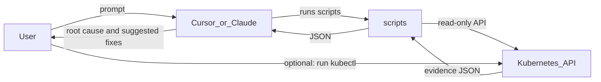

# EKS Kubernetes Troubleshooting Skill

A **Cursor / Claude Code agent skill** for read-only Kubernetes and Amazon EKS troubleshooting. The agent runs Python scripts against your local kubeconfig, collects structured evidence (logs, events, deployments), and explains what is wrong — without modifying your cluster.

## Problem

- Pod crashes, OOM, image pull failures, and deployment mismatches are tedious to triage manually across contexts and namespaces
- Engineers repeat the same `kubectl` commands and paste logs into chat
- AI answers without cluster evidence are often generic or wrong
- Letting an agent run mutating commands during an incident is risky

## Solution

The agent gathers facts from your cluster, analyzes structured JSON, and suggests fixes — you decide whether to run them.



Everything is **read-only**. The skill never applies, deletes, scales, or restarts resources unless you explicitly ask.

## Prerequisites

| Requirement | Notes |
|-------------|-------|
| Python 3.10+ | Run scripts |
| Working kubeconfig | `kubectl get ns` succeeds |
| EKS access (if applicable) | You run `aws sso login` and `aws eks update-kubeconfig` yourself |
| Cursor or Claude Code | With skills support |

## Installation

**1. Clone and install dependencies**

```bash
git clone <repo-url>
cd eks-kubernetes-troubleshooting-skill
python3 -m venv .venv && source .venv/bin/activate
pip install -r requirements.txt
```

**2. Install as a skill**

Copy or symlink this folder so it contains `SKILL.md`:

| Tool | Project | Personal |
|------|---------|----------|
| **Cursor** | `.cursor/skills/eks-kubernetes-troubleshooting/` | `~/.cursor/skills/eks-kubernetes-troubleshooting/` |
| **Claude Code** | `.claude/skills/eks-kubernetes-troubleshooting/` | `~/.claude/skills/eks-kubernetes-troubleshooting/` |

**3. Optional — tailor fix advice for your org**

```bash
cp context/deployment-context.example.txt context/deployment-context.txt
# edit locally — gitignored
```

## User prompt sequence

Use these prompts in chat. Replace placeholders with values from discovery steps.

**1. Discover**

- "List Kubernetes contexts on my machine."
- "What namespaces exist in context `<context>`?"

**2. Scan**

- "Run a health scan on namespace `staging` in context `<context>` and summarize issues."

**3. Investigate**

- Pod: "Investigate pod `<pod>` in namespace `staging` — why is it crash looping?"
- Namespace: "Investigate all unhealthy resources in namespace `staging` and give root cause analysis."

**4. Remediate (suggest only)**

- "Based on the investigation, suggest kubectl commands to fix this — do not run them."

**5. Optional — history**

- "Search my investigation history for past OOMKilled issues in namespace `staging`."

More prompts: [examples/sample_prompts.md](./examples/sample_prompts.md)
